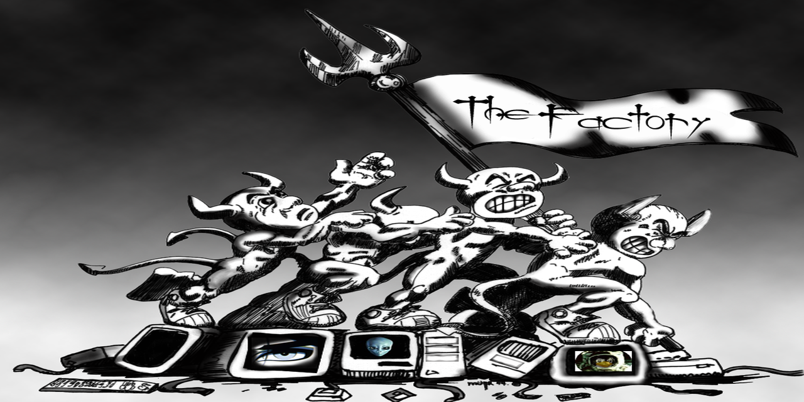

# THE_FACTORY

A terminal-driven video processing pipeline designed for non-destructive, batch-safe, intro-aware media preparation.

THE_FACTORY automates complex, repetitive workflows such as intro detection, clean cutting, subtitle handling, metadata repair, and batch normalization—while preserving original files at every stage.

---

## PURPOSE

WHAT THE_FACTORY DOES NOT DO

- Does not overwrite original files
- Does not re-encode unless required
- Does not guess or auto-correct without user confirmation

THE_FACTORY exists to:

- process full media sets (e.g., TV seasons) safely  
- automate intro detection and removal  
- normalize sources for reliable downstream operations  
- maintain continuity across runs using file-based state  

---

## CORE DESIGN

### Non-Destructive Workflow

- Original files are never modified directly  
- OEM backups are created and protected  
- All processing occurs on derived files  

---

### Pipeline-Based Processing

THE_FACTORY is structured as a staged pipeline:

Each stage builds on the previous, ensuring consistent and predictable results.

---

### File-Based State Tracking

THE_FACTORY uses persistent CSV files to maintain continuity:

- `intro_map.csv` — detected intro boundaries  
- `episodes.csv` — episode naming and mapping  
- `info.csv` — processing cache and REKEY validation  

This enables:
- resume-safe operation  
- caching of expensive operations  
- consistent file identity across runs  

---

## KEY DESIGN PRINCIPLES

### Stream-Copy First

- Prefer stream copy wherever possible  
- Avoid re-encoding unless required  
- Preserve quality and maximize speed  

---

### Human-Readable Feedback

- Color-coded terminal output  
- Clear status indicators  
- Verbose progress and diagnostics  

---

### Safe Interaction Model

- 10-key friendly input  
- Time formats supported:
  - seconds (`120`)
  - `hh:mm:ss`
  - decimal (`2.20`)
- Exit tokens:
  - `0.`
  - `q`

---

### Dependency Awareness

- Built-in dependency checks  
- Clear reporting of missing tools  
- Optional enhancements supported  

---

## REQUIREMENTS

### Core

- ffmpeg / ffprobe  
- bc  
- awk / sed / grep  
- coreutils  

### Optional

- mkvtoolnix (`mkvpropedit`)  
- python3  
- pipx  
- scenedetect (OpenCV backend)  

---

## TYPICAL USE CASE

Processing a full TV season:

1. Place `factory.sh` inside the episode folder  
2. Launch the script  
3. Follow guided pipeline stages  

Typical flow:

- OEM_Backups  →  Copy Eligible Targets To `OEM dir` and Prefix the name with `OEM_filename` 
- Check source suitability for clean cuts and flag "risky" files
- Optionally rebuild sources (REKEY) with ~1-second keyframes for reliable cuts and joins
- All processed outputs are normalized to MKV format. Exception is OEM_backups they are whatever they were.
- Build Template → create example of the intro reference, hopefully from `REKEY_ Sources`
- Detect Intros → `This Is Magic Right Here Folks` IntroFind finds the intro and enters times into generated `intro_map.csv`  
- Run GAPMAN → remove intros cleanly, supports fine adjustment of cut timing when needed with ( pre , post , overall drift, start of, end of ) intro cut padding
- Apply Title / Subtitle fixes and set what you see in the titlebar of your player not just filenames
- Finalize outputs → cleanup and rename files, dump temps, originals, and decide what to do with protected OEM_backups, option to tar them up 

---

## WHAT THE_FACTORY DOES

### 1. Source Preparation (OEM Protection)

- Creates protected backups of originals  
- Applies prefix-based shielding to prevent files from being processed more than once  
- Displays disk usage and warnings  

**Outputs:** working_dir/OEM/OEM_file_name.*** these files are not modded at all (only renamed with prefix_) and remain whatever .ext they were to begin with.

---

### 2. Batch Normalizer (REKEY Pipeline)

- Converts sources into cut-friendly format  
- Enforces controlled GOP structure (~1s keyframes)  
- Aligns encoding for safe downstream operations  
- Uses rolling output evaluation to detect unexpected growth or shrink behavior  
- Can adapt CRF strategy based on real file results during a batch  

Throughput is safety-driven rather than purely speed-driven.  
When adaptive normalization logic is active, parallelism may be reduced so each completed file can inform later decisions.

---

### 3. Template Builder

- Extracts clean intro templates from sources  
- Uses manual time selection for precision  
- Normalizes output to MKV  

Templates stored in: working_dir/intro_template

---

### 4. Intro Detection (IntroFind Engine)

- Uses perceptual hashing (pHash)  
- Multi-anchor matching (e.g., 3s, 5s, 7s)  
- Scans timeline for best match  

Produces:

- `intro_map.csv` (start/end per episode)

Displays:

- confidence scoring  
- ranked candidates  
- diagnostic insight  

---

### 5. GAPMAN (Intro Removal Engine)

- CSV-driven batch processing  
- Removes intros using stream-copy concat  

Supports:

- global offset adjustment  
- pre-trim (logos)  
- post-trim (credits)  

**Outputs:** working_dir/SUTURED_file_name.mkv

---

### 6. Subtitle Processing (SUBTOX)

- Pack external `.srt` into video  
- Extract internal subtitle tracks  
- Rename using `episodes.csv` mapping  

**Outputs:** working_dir/SUBTOX_file_name.mkv

---

### 7. Metadata & Playback Fix (BARFIX)

- Fix title metadata (player-visible titles)  
- Set playback defaults:
  - preferred audio (English if available)  
  - subtitles disabled by default  

Modes:

- metadata-only  
- playback-only  
- combined  

**Outputs:** working_dir/BARFIX_file_name.mkv

---

### 8. Cleanup / Finalization

- Promotes `SUTURED_` files to final outputs  
- Handles OEM backups:
  - archive  
  - delete  
  - retain  
- Removes temporary artifacts  
- Marks completed directories  

---

### 9. Manual Tools

- File Inspection Tools
- ffprobe-based comparison
- Custom segment cutting
- Clip joining: Exported, https://github.com/secarider/CHARLIES-CUSTOM-CUTS/tree/main
- One-Off Clip Cutting (Brutal + Accurate) - Join Any Two Clips Together  
- Archival_Array: Exported, https://github.com/secarider/Archies-Archival-Array/tree/main
- Archival_Array: For dealing with dash/body/game cam dump folders and the hundreds of files they contain that you said you would sort
- Archival_Array: We can strip (or not) the metadata, save that to the side, then squeeze the files down small and tarball em . 

**Outputs:** ARCHIVE_L1_file_name.mkv Depending On Compression Level L1,L2,L3,L4 

---

## FILE NAMING & NORMALIZATION

- Enforces underscore-based naming  
- Aligns with `SxxExx` conventions  
- Supports user-selected title segment offsets  
- Removes illegal or problematic characters  

---

## PHILOSOPHY

THE_FACTORY is designed to be:

- non-destructive  
- deterministic  
- scalable  
- interruption-safe  
- transparent  

> Complex work, made repeatable.  
> Destructive operations, made deliberate.  
> Results you can trust.
